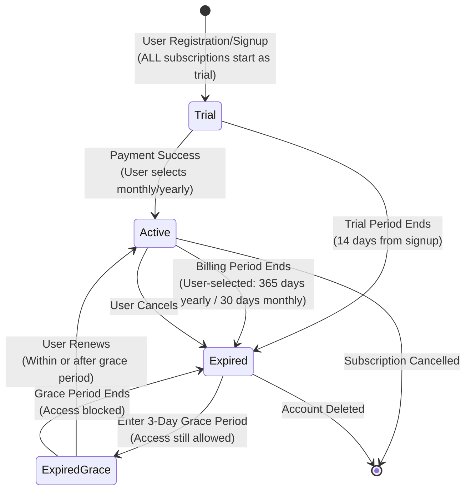
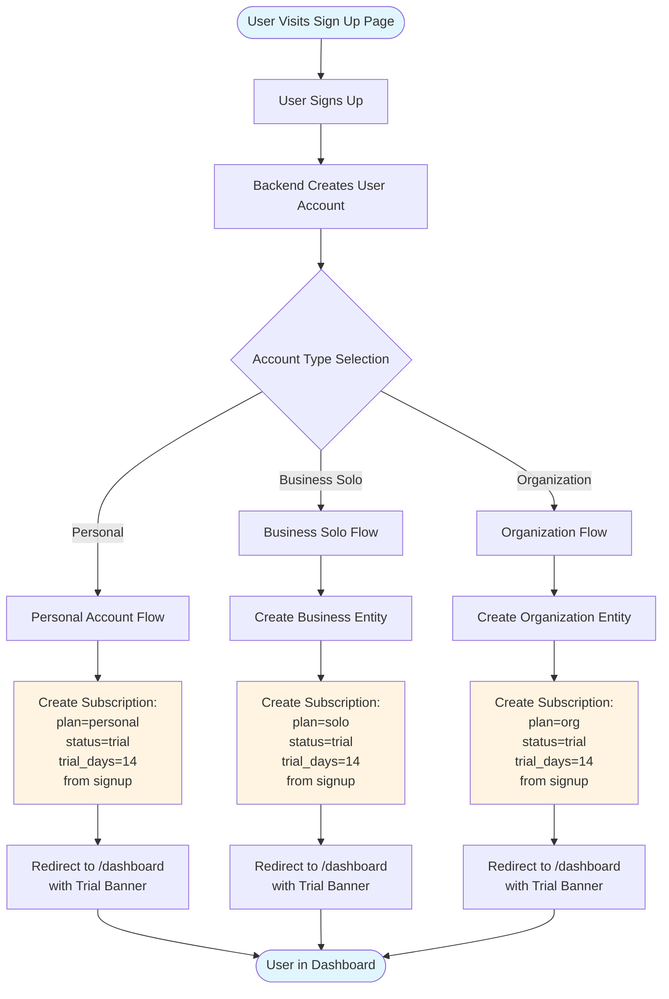
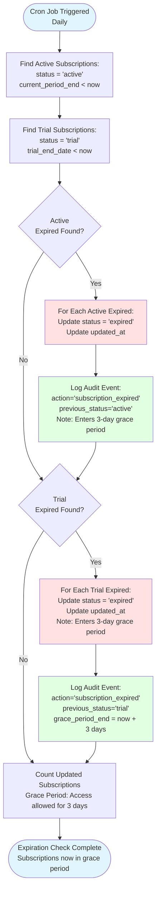

# Subscription System Flowchart

This document contains comprehensive flowcharts for the OdinRing subscription system.

## Table of Contents

1. [Subscription Lifecycle Flow](#subscription-lifecycle-flow)
2. [User Signup and Onboarding Flow](#user-signup-and-onboarding-flow)
3. [Subscription Creation Flow](#subscription-creation-flow)
4. [Subscription Activation Flow](#subscription-activation-flow)
5. [Subscription Expiration Flow](#subscription-expiration-flow)
6. [Access Control Flow](#access-control-flow)
7. [Payment Processing Flow](#payment-processing-flow)

---

## Subscription Lifecycle Flow



**Status Transitions:**
- **Trial**: 14-day free trial from signup (ALL subscription plans start here)
- **Active**: Paid subscription with full access (user selects monthly or yearly billing)
- **Expired**: Trial or subscription period ended (enters 3-day grace period)
- **Grace Period**: 3 days after expiration - access still allowed, user can renew

---

## User Signup and Onboarding Flow



---

## Subscription Creation Flow

```mermaid
flowchart TD
    Start([Subscription Creation Triggered]) --> ValidateInput[Validate Input:<br/>account_type<br/>plan<br/>trial_days]
    
    ValidateInput --> CalculateTrialDates[Calculate Trial Dates:<br/>trial_start = signup time<br/>trial_end = trial_start + 14 days<br/>(Fixed for all plans)]
    
    CalculateTrialDates --> SetStatusTrial[Set status = 'trial'<br/>(ALL subscriptions start as trial)]
    
    SetStatusTrial --> CreateSubscriptionObj[Create Subscription Object:<br/>- Set subscriber_reference<br/>(user_id/business_id/org_id)<br/>- Set plan<br/>- Set status = 'trial'<br/>- Set trial dates (14 days from signup)<br/>- Generate UUID]
    
    CreateSubscriptionObj --> SaveToFirestore[Save to Firestore<br/>collection: 'subscriptions']
    
    SaveToFirestore --> LogAuditEvent{Status = Trial?}
    LogAuditEvent -->|Yes| LogTrialStarted[Log Audit Event:<br/>action='trial_started']
    LogAuditEvent -->|No| ReturnSubscription[Return Subscription Object]
    
    LogTrialStarted --> ReturnSubscription
    ReturnSubscription --> End([Subscription Created])
    
    style Start fill:#e1f5ff
    style End fill:#e1f5ff
    style CreateSubscriptionObj fill:#fff4e1
    style SaveToFirestore fill:#ffe1e1
```

---

## Subscription Activation Flow

```mermaid
flowchart TD
    Start([Payment Success Event]) --> GetSubscription[Get Subscription by ID]
    GetSubscription --> ValidateStatus{Status Valid?<br/>(trial or expired)}
    
    ValidateStatus -->|No| Error1[Return Error:<br/>Invalid Status]
    ValidateStatus -->|Yes| GetBillingCycle[Get User-Selected Billing Cycle<br/>(monthly/yearly toggle)]
    
    GetBillingCycle --> CalculatePeriodEnd{User Selected<br/>Billing Cycle?}
    CalculatePeriodEnd -->|Yearly| SetYearlyEnd[Calculate End Date:<br/>current_period_start = now<br/>current_period_end = now + 365 days]
    CalculatePeriodEnd -->|Monthly| SetMonthlyEnd[Calculate End Date:<br/>current_period_start = now<br/>current_period_end = now + 30 days]
    
    SetYearlyEnd --> UpdateSubscription[Update Subscription in Firestore:<br/>- status = 'active'<br/>- current_period_start<br/>- current_period_end<br/>- billing_cycle<br/>- updated_at]
    SetMonthlyEnd --> UpdateSubscription
    
    UpdateSubscription --> LogActivation[Log Audit Event:<br/>action='subscription_activated']
    LogActivation --> ReturnSuccess[Return Success]
    ReturnSuccess --> End([Subscription Activated])
    
    Error1 --> End
    
    style Start fill:#e1f5ff
    style End fill:#e1f5ff
    style UpdateSubscription fill:#fff4e1
    style LogActivation fill:#e1ffe1
```

---

## Subscription Expiration Flow



---

## Access Control Flow

```mermaid
flowchart TD
    Start([User Requests Dashboard]) --> Authenticate{User<br/>Authenticated?}
    
    Authenticate -->|No| RedirectLogin[Redirect to /auth/login]
    Authenticate -->|Yes| GetIdentityContext[Get Identity Context:<br/>GET /me/context]
    
    GetIdentityContext --> GetAccountType[Extract Account Type]
    GetAccountType --> GetSubscription[Extract Subscription Status]
    
    GetSubscription --> CheckAccountType{Account Type?}
    
    CheckAccountType -->|Personal| CheckPersonalStatus{Subscription<br/>Status?}
    CheckAccountType -->|Business Solo| CheckBusinessStatus{Subscription<br/>Status?}
    CheckAccountType -->|Organization| CheckOrgStatus{Subscription<br/>Status?}
    
    CheckPersonalStatus -->|trial/active| AllowPersonal[Allow Access<br/>Route: /dashboard]
    CheckPersonalStatus -->|expired| CheckGracePeriod1{Within 3-Day<br/>Grace Period?}
    
    CheckBusinessStatus -->|trial/active| AllowBusiness[Allow Access<br/>Route: /dashboard]
    CheckBusinessStatus -->|expired| CheckGracePeriod2{Within 3-Day<br/>Grace Period?}
    
    CheckOrgStatus -->|trial/active| AllowOrg[Allow Access<br/>Route: /dashboard]
    CheckOrgStatus -->|expired| CheckGracePeriod3{Within 3-Day<br/>Grace Period?}
    
    CheckGracePeriod1 -->|Yes| AllowPersonalGrace[Allow Access<br/>(Grace Period)<br/>Route: /dashboard<br/>Show renewal warning]
    CheckGracePeriod1 -->|No| BlockPersonal[Block Access<br/>Redirect: /billing/choose-plan]
    
    CheckGracePeriod2 -->|Yes| AllowBusinessGrace[Allow Access<br/>(Grace Period)<br/>Route: /dashboard<br/>Show renewal warning]
    CheckGracePeriod2 -->|No| BlockBusiness[Block Access<br/>Redirect: /billing/choose-plan]
    
    CheckGracePeriod3 -->|Yes| AllowOrgGrace[Allow Access<br/>(Grace Period)<br/>Route: /dashboard<br/>Show renewal warning]
    CheckGracePeriod3 -->|No| BlockOrg[Block Access<br/>Redirect: /billing/choose-plan]
    
    AllowPersonal --> End([Access Granted])
    AllowBusiness --> End
    AllowOrg --> End
    AllowPersonalGrace --> End
    AllowBusinessGrace --> End
    AllowOrgGrace --> End
    
    RedirectLogin --> End2([Redirected])
    BlockBusiness --> End2
    BlockOrg --> End2
    BlockPersonal --> End2
    
    style Start fill:#e1f5ff
    style End fill:#e1ffe1
    style End2 fill:#ffe1e1
    style AllowPersonal fill:#e1ffe1
    style AllowBusiness fill:#e1ffe1
    style AllowOrg fill:#e1ffe1
    style BlockBusiness fill:#ffe1e1
    style BlockOrg fill:#ffe1e1
```

---

## Payment Processing Flow

```mermaid
flowchart TD
    Start([User on Checkout Page]) --> SelectPlan[User Selects Plan]
    SelectPlan --> FillPaymentForm[User Fills Payment Form:<br/>- Card Details<br/>- Billing Address<br/>- Name]
    
    FillPaymentForm --> ValidateForm{Form<br/>Valid?}
    ValidateForm -->|No| ShowErrors[Show Validation Errors]
    ShowErrors --> FillPaymentForm
    
    ValidateForm -->|Yes| SubmitPayment[Submit Payment Request<br/>POST /checkout/process]
    
    SubmitPayment --> ProcessPayment[Backend Processes Payment:<br/>- Validate subscription<br/>- Process payment<br/>(Mock/Stripe)]
    
    ProcessPayment --> PaymentResult{Payment<br/>Success?}
    
    PaymentResult -->|No| PaymentFailed[Payment Failed]
    PaymentFailed --> RedirectFailed[Redirect to /payment/failed]
    RedirectFailed --> EndFailed([Payment Failed Page])
    
    PaymentResult -->|Yes| SelectBillingCycle[User Selects Billing Cycle:<br/>Monthly or Yearly Toggle]
    SelectBillingCycle --> ActivateSubscription[Activate Subscription:<br/>- Update status = 'active'<br/>- Set billing period dates<br/>(based on user selection)<br/>- Store transaction ID]
    
    ActivateSubscription --> LogPayment[Log Payment Transaction]
    LogPayment --> RedirectSuccess[Redirect to /payment/success]
    RedirectSuccess --> RefreshContext[Refresh Identity Context]
    RefreshContext --> RedirectDashboard[Redirect to /dashboard]
    RedirectDashboard --> EndSuccess([Dashboard with Active Subscription])
    
    style Start fill:#e1f5ff
    style EndSuccess fill:#e1ffe1
    style EndFailed fill:#ffe1e1
    style ActivateSubscription fill:#fff4e1
    style ProcessPayment fill:#e1f5ff
```

---

## Complete User Journey Flow

```mermaid
flowchart TD
    Start([New User Journey]) --> SignUp[1. User Signs Up]
    SignUp --> Onboarding[2. Account Type Selection<br/>Onboarding]
    
    Onboarding --> AccountType{Account Type}
    AccountType -->|Personal| PersonalCreate[3a. Create Personal Account<br/>Subscription: trial<br/>14 days from signup]
    AccountType -->|Business Solo| BusinessCreate[3b. Create Business Account<br/>Subscription: trial<br/>14 days from signup]
    AccountType -->|Organization| OrgCreate[3c. Create Organization<br/>Subscription: trial<br/>14 days from signup]
    
    PersonalCreate --> Dashboard1[4. Dashboard Access<br/>Trial Active]
    BusinessCreate --> Dashboard2[4. Dashboard Access<br/>Trial Active]
    OrgCreate --> Dashboard3[4. Dashboard Access<br/>Trial Active]
    
    Dashboard1 --> TrialBanner[5. See Trial Banner<br/>14 days remaining]
    Dashboard2 --> TrialBanner
    Dashboard3 --> TrialBanner
    
    TrialBanner --> UserAction{User Action}
    UserAction -->|Continue Trial| UseTrial[6a. Continue Using<br/>During Trial]
    UserAction -->|Upgrade Now| ChoosePlan[6b. Go to Choose Plan]
    
    UseTrial --> TrialExpires[7. Trial Expires<br/>(14 days)]
    TrialExpires --> ChoosePlan
    
    ChoosePlan --> SelectPlan[8. Select Plan]
    SelectPlan --> SelectBillingCycle2[8b. Select Billing Cycle<br/>Monthly or Yearly Toggle]
    SelectBillingCycle2 --> Checkout[9. Checkout Page]
    Checkout --> Payment[10. Enter Payment]
    Payment --> ProcessPayment{Payment<br/>Result}
    
    ProcessPayment -->|Success| Activate[11. Activate Subscription<br/>status = active<br/>(with selected billing cycle)]
    ProcessPayment -->|Failed| RetryPayment[11. Payment Failed<br/>Retry Option]
    
    RetryPayment --> Checkout
    Activate --> ActiveDashboard[12. Dashboard with<br/>Active Subscription]
    
    ActiveDashboard --> ManageSub{Manage<br/>Subscription?}
    ManageSub -->|Yes| ManagePage[13. Subscription Management<br/>View Details]
    ManageSub -->|No| ContinueUse[14. Continue Using]
    
    ManagePage --> ContinueUse
    
    ContinueUse --> SubscriptionEnds[15. Subscription Period Ends<br/>(User-selected: 30 days monthly / 365 days yearly)]
    SubscriptionEnds --> EnterGracePeriod[15b. Enter 3-Day Grace Period<br/>Access Still Allowed]
    
    EnterGracePeriod --> RenewPrompt[16. Renewal Prompt<br/>(Within Grace Period)]
    RenewPrompt --> RenewDecision{Renew?}
    
    RenewDecision -->|Yes| SelectBillingCycle3[Select Billing Cycle<br/>Monthly/Yearly]
    SelectBillingCycle3 --> ChoosePlan
    RenewDecision -->|No| GracePeriodEnds[17. Grace Period Ends<br/>(3 days after expiration)]
    
    GracePeriodEnds --> SubscriptionExpired[18. Subscription Expired<br/>Access Blocked<br/>Redirect to /billing]
    
    SubscriptionExpired --> End([User Must Renew])
    ContinueUse --> End2([Continue Using])
    
    style Start fill:#e1f5ff
    style End fill:#ffe1e1
    style End2 fill:#e1ffe1
    style Activate fill:#fff4e1
    style TrialExpires fill:#ffe1e1
    style SubscriptionExpired fill:#ffe1e1
```

---

## Status Decision Tree

```mermaid
flowchart TD
    Start([Subscription Status Check]) --> GetCurrentStatus[Get Current Status]
    
    GetCurrentStatus --> StatusType{Status Type?}
    
    StatusType -->|trial| TrialPath{Check<br/>trial_end_date}
    TrialPath -->|trial_end_date > now| TrialActive[Status: trial (active)<br/>- 14 days from signup<br/>- Days remaining calculated<br/>- Access: Full features]
    TrialPath -->|trial_end_date <= now| TrialExpired[Status: trial (should be expired)<br/>- Run expiration job<br/>- Set status = 'expired'<br/>- Enter grace period]
    
    StatusType -->|active| ActivePath{Check<br/>current_period_end}
    ActivePath -->|current_period_end > now| ActiveValid[Status: active (valid)<br/>- User-selected billing cycle<br/>- Days remaining calculated<br/>- Access: Full features]
    ActivePath -->|current_period_end <= now| ActiveExpired[Status: active (should be expired)<br/>- Run expiration job<br/>- Set status = 'expired'<br/>- Enter grace period]
    
    StatusType -->|expired| ExpiredPath{Check Grace Period<br/>expiration_date + 3 days}
    ExpiredPath -->|Within Grace Period| ExpiredGrace[Status: expired (grace period)<br/>- Access: Allowed<br/>- Show renewal warning<br/>- Route: /dashboard]
    ExpiredPath -->|After Grace Period| ExpiredBlocked[Status: expired (grace ended)<br/>- Access: Blocked<br/>- Redirect: /billing/choose-plan<br/>- Action: User must renew]
    
    TrialActive --> End([Status Determined])
    TrialExpired --> End
    ActiveValid --> End
    ActiveExpired --> End
    ExpiredGrace --> End
    ExpiredBlocked --> End
    
    style Start fill:#e1f5ff
    style End fill:#e1ffe1
    style TrialActive fill:#e1ffe1
    style ActiveValid fill:#e1ffe1
    style TrialExpired fill:#ffe1e1
    style ActiveExpired fill:#ffe1e1
    style ExpiredPath fill:#ffe1e1
```

---

## Notes on Flowcharts

### Color Coding
- **Blue (#e1f5ff)**: Start/Entry points
- **Green (#e1ffe1)**: Success/Allowed states
- **Red (#ffe1e1)**: Errors/Blocked states
- **Yellow (#fff4e1)**: Important operations/Processes

### Key Concepts

1. **Idempotency**: The expiration check cron job is idempotent - it can be run multiple times safely
2. **Status Consistency**: Status transitions are one-way in most cases (except expired → active)
3. **Access Control**: Access decisions are made based on both account type and subscription status
4. **Trial Period**: Fixed at 14 days from creation, cannot be extended
5. **Billing Periods**: Yearly (365 days) or Monthly (30 days)

### State Persistence

All subscription states are persisted in Firestore:
- Status changes are immediately saved
- Date fields are stored as UTC timestamps
- Audit logs track all state transitions

---

**Last Updated**: 2024-01-29

